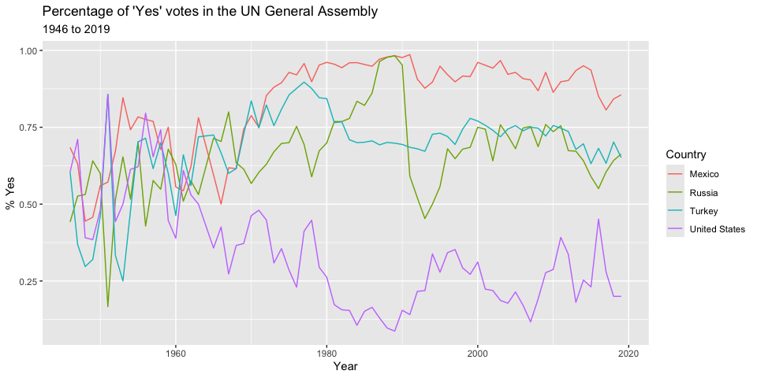
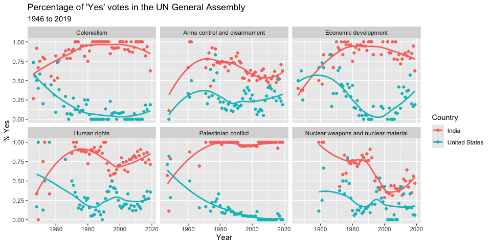

# Your First Quarto Document
Your Name
2025-01-10

- [Goals](#goals)
- [Background](#background)
- [Data](#data)
- [Analysis](#analysis)
- [Exercises](#exercises)
- [References](#references)

## Goals

- Get acquainted with the Quarto document look and feel
- Practice with rendering a Quarto document to a **gfm** file
  (GitHub-flavored Markdown)
- See more examples of the use of **ggplot2**
- Preview the kinds of data transformations to come
- Preview the use of the pipe (`|>`) for chaining functions

## Background

Let’s take a look at the voting history of countries in the United
Nations General Assembly. We will be using data from the **unvotes**
package. Additionally, we will make use of the **tidyverse** and
**lubridate** packages for the analysis, and the **DT** package for
interactive display of tabular output.

## Data

The unvotes package provides three data sets we can work with:
`un_roll_calls`, `un_roll_call_issues`, and `un_votes`. Each of these
datasets contains a variable called `rcid`, the roll call id, which can
be used as a unique identifier to join them with each other.

- The `un_votes` data set provides information on the voting history of
  the United Nations General Assembly. It contains one row for each
  country-vote pair.

``` r
un_votes
```

    # A tibble: 869,937 × 4
        rcid country            country_code vote 
       <dbl> <chr>              <chr>        <fct>
     1     3 United States      US           yes  
     2     3 Canada             CA           no   
     3     3 Cuba               CU           yes  
     4     3 Haiti              HT           yes  
     5     3 Dominican Republic DO           yes  
     6     3 Mexico             MX           yes  
     7     3 Guatemala          GT           yes  
     8     3 Honduras           HN           yes  
     9     3 El Salvador        SV           yes  
    10     3 Nicaragua          NI           yes  
    # ℹ 869,927 more rows

- The `un_roll_calls` dataset contains information on each roll call
  vote of the United Nations General Assembly.

``` r
un_roll_calls
```

    # A tibble: 6,202 × 9
        rcid session importantvote date       unres   amend  para short        descr
       <int>   <dbl>         <int> <date>     <chr>   <int> <int> <chr>        <chr>
     1     3       1             0 1946-01-01 R/1/66      1     0 AMENDMENTS,… "TO …
     2     4       1             0 1946-01-02 R/1/79      0     0 SECURITY CO… "TO …
     3     5       1             0 1946-01-04 R/1/98      0     0 VOTING PROC… "TO …
     4     6       1             0 1946-01-04 R/1/107     0     0 DECLARATION… "TO …
     5     7       1             0 1946-01-02 R/1/295     1     0 GENERAL ASS… "TO …
     6     8       1             0 1946-01-05 R/1/297     1     0 ECOSOC POWE… "TO …
     7     9       1             0 1946-02-05 R/1/329     0     0 POST-WAR RE… "TO …
     8    10       1             0 1946-02-05 R/1/361     1     1 U.N. MEMBER… "TO …
     9    11       1             0 1946-02-05 R/1/376     0     0 TRUSTEESHIP… "TO …
    10    12       1             0 1946-02-06 R/1/394     1     1 COUNCIL MEM… "TO …
    # ℹ 6,192 more rows

- The `un_roll_call_issues` dataset contains (topic) classifications of
  roll call votes of the United Nations General Assembly. Many votes had
  no topic, and some have more than one.

``` r
un_roll_call_issues
```

    # A tibble: 5,745 × 3
        rcid short_name issue               
       <int> <chr>      <fct>               
     1    77 me         Palestinian conflict
     2  9001 me         Palestinian conflict
     3  9002 me         Palestinian conflict
     4  9003 me         Palestinian conflict
     5  9004 me         Palestinian conflict
     6  9005 me         Palestinian conflict
     7  9006 me         Palestinian conflict
     8   128 me         Palestinian conflict
     9   129 me         Palestinian conflict
    10   130 me         Palestinian conflict
    # ℹ 5,735 more rows

## Analysis

First, let’s take a look at how often each country voted “Yes” on a
resolution in each year. We’ll visualize the results, so let’s pick a
few countries of interest first,

``` r
country_list <- c("United States", "Russia", 
                  "Mexico", "Turkey")
```

and focus our analysis on them.

``` r
un_votes |>
  filter(country %in% country_list) |>
  inner_join(un_roll_calls, by = "rcid") |>
  group_by(year = year(date), country) |>
  summarize(
    votes = n(),
    percent_yes = mean(vote == "yes")
    ) |>
  ggplot(mapping = aes(x = year, y = percent_yes, color = country)) +
    geom_line() +
    labs(
      title = "Percentage of 'Yes' votes in the UN General Assembly",
      subtitle = "1946 to 2019",
      y = "% Yes",
      x = "Year",
      color = "Country"
    )
```



Next, let’s create a visualization that displays how the voting record
of the United States changed over time on a variety of issues, and
compares it to another country. The other country we’ll display is
India.

``` r
un_votes |>
  filter(country %in% c("United States", "India")) |>
  inner_join(un_roll_calls, by = "rcid") |>
  inner_join(un_roll_call_issues, by = "rcid") |>
  group_by(country, year = year(date), issue) |>
  summarize(
    votes = n(),
    percent_yes = mean(vote == "yes")
    ) |>
  filter(votes > 5) |>  # only use records where there are more than 5 votes
  ggplot(mapping = aes(x = year, y = percent_yes, color = country)) +
    geom_point() +
    geom_smooth(method = "loess", se = FALSE) +
    facet_wrap(~ issue) +
    labs(
      title = "Percentage of 'Yes' votes in the UN General Assembly",
      subtitle = "1946 to 2019",
      y = "% Yes",
      x = "Year",
      color = "Country"
    )
```



We can easily change which countries are being plotted by changing which
countries the code above `filter`s for. Note that the country name
should be spelled and capitalized exactly the same way as it appears in
the data. See the [Appendix](#appendix) for a list of the countries in
the data.

## Exercises

1.  Try modifying the code above substituting the names of other
    countries. (You can browse the **un_votes** data set to check the
    spelling.)
2.  Try modifying aesthetics of the graphs.
3.  What does `method = "loess"` mean?

Source of this activity: [*Data Science in a
Box*](https://datasciencebox.org/).

## References

1.  David Robinson (2017). unvotes: United Nations General Assembly
    Voting Data. R package version 0.2.0.
    https://CRAN.R-project.org/package=unvotes.
2.  Erik Voeten “Data and Analyses of Voting in the UN General Assembly”
    Routledge Handbook of International Organization, edited by Bob
    Reinalda (published May 27, 2013).
3.  Much of the analysis has been modeled on the examples presented in
    the [unvotes package
    vignette](https://cran.r-project.org/web/packages/unvotes/vignettes/unvotes.html).
